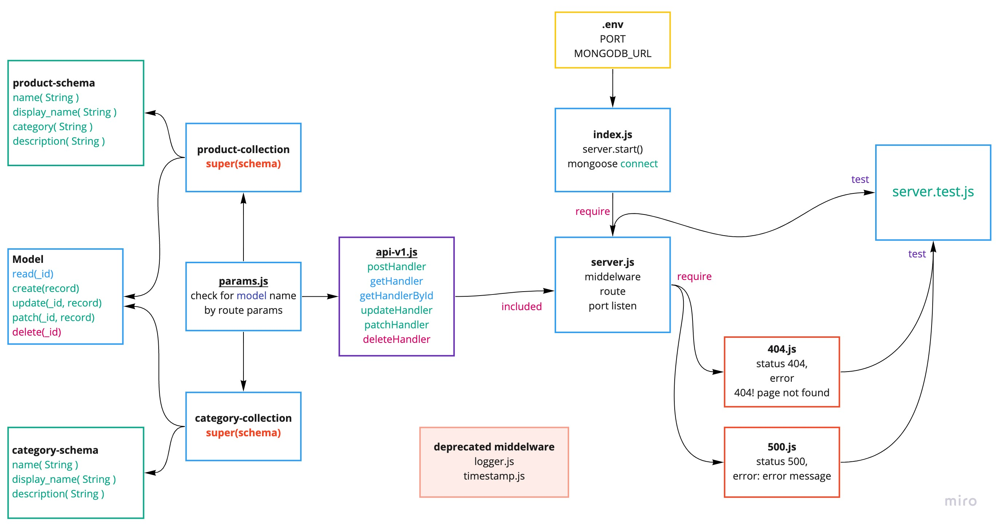

# api-server
  

In this final phase, we’ll be making our API easier to manage, and much more extensible, allowing for it to automatically recognize new data models, backed by any database type. We’ll also be preparing it for delivery with a full suite of documentation, tests, and a permanent deployment

**Author** _Waleed A. Afifi_

 ## Links and Resources
- SwaggerHub : 
   - [Product hub Link](https://app.swaggerhub.com/apis/wafifi/products/0.1)
   - [Categories hub Link](https://app.swaggerhub.com/apis/wafifi/class08-categoory/0.1)
- [submission PR/lab-09 ](https://github.com/waleedafifi-401-advanced-javascript/api-server/pull/5)
 

### Setup

- install json-server `npm i -g json-server`
- install express `npm i express`
- install nodemon `npm i nodemon --dev`
- install jest `npm i jest --dev`
- install supertest `npm i supertest --dev`
- install eslint `npm i eslint --dev`
- install morgan `npm i morgan`
- install supergoose `npm i @code-fellows/supergoose --dev`


* edit `package.json` where `script` -> `"test": "jest --coverage --verbose"`
* edit `package.json` where `script` -> 
   ```
       "lint:js": "eslint './**/*.js' --ignore-pattern node_modules/",
       "lint:js:fix": "eslint './**/*.js' --ignore-pattern node_modules/ --fix"

   ```
## How to initialize/run your application (where applicable)

* `json-server --watch ./data/db.json`
   * the code above for testing from json server dummy data
* `npm run dev` -> test stretch goals 
   * the code above test using express with custom response format
   ```
   {
       Count: 3,
       Categories: [
           {},
           {},
           {}
       ]
   } 
   ```

* Logger will be like bottom
```
GET /categories 200 44.771 ms - 448
POST /categories 200 44.771 ms - 448
PUT /categories/5f60ac298f45f42e441b04bb 200 44.771 ms - 448
PATCH /categories/5f60ac298f45f42e441b04bb 200 44.771 ms - 448
DELETE /categories/5f60ac298f45f42e441b04bb 200 44.771 ms - 448
```

### http request
```
http://loocalhost:3000/categories {GET, POST}
http://loocalhost:3000/categories/5f60ac298f45f42e441b04bb {GET, PUT, PATCH}
http://loocalhost:3000/products {GET, POST}
http://loocalhost:3000/products/5f60ac298f45f42e441b04bb {GET, PUT, PATCH}
```
 
### Testing
- `npm run test`
- Test files
   - `server.test.js`

### Models file
- model.js
- products
   - products.collectios.js
   - products.schema.js
- categories
   - categories.collectios.js
   - categories.schema.js

### Routes
1. api-v1.js
   * params.js

##### Routing work through
App. now deal with all route from one place api-v1.js handle all route `POST/GET/PUT/PATCH/DELETE` -> require params.js to handle model files and return the model class to api

### eslint CLI command
```
   npm run lint:js // Show what need to fix
   npm run lint:js:fix // Fix lint error

```
## UML


