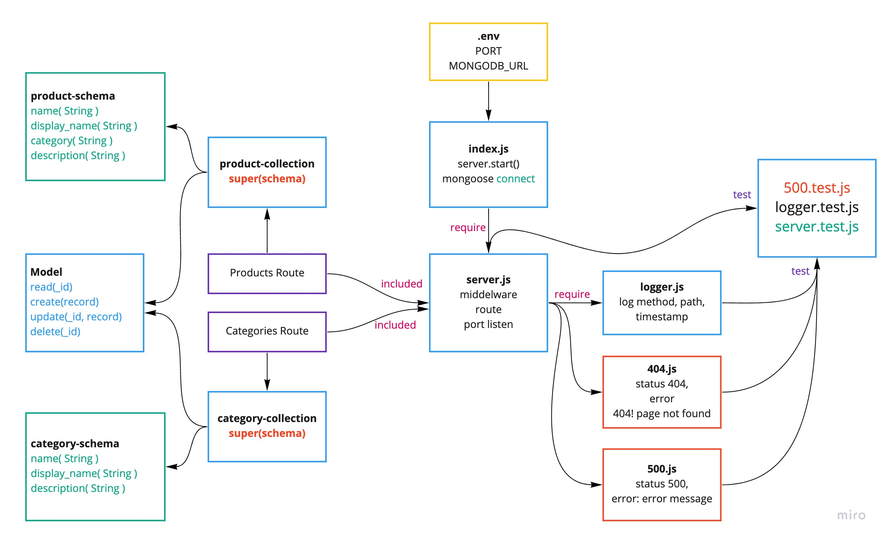

# api-server
In this 3rd phase of development, we’ll be modularizing our server, making it easier to manage as well as adding a much needed persistence layer, saving all API data to a Mongo database.


 ## Links and Resources
- SwaggerHub : 
   - [Product hub Link](https://app.swaggerhub.com/apis/wafifi/products/0.1)
   - [Categories hub Link](https://app.swaggerhub.com/apis/wafifi/class08-categoory/0.1)
- [submission PR/lab-06 ](https://github.com/waleedafifi-401-advanced-javascript/api-server/pull/3)
 

### Setup

- install json-server `npm i -g json-server`
- install express `npm i express`
- install nodemon `npm i nodemon --dev`
- install jest `npm i jest --dev`
- install supertest `npm i supertest --dev`
- install eslint `npm i eslint --dev`
- install morgan `npm i morgan`
- install supergoose `npm i @code-fellows/supergoose --dev`


* edit `package.json` where `script` -> `"test": "jest --coverage --verbose"`
* edit `package.json` where `script` -> 
   ```
       "lint:js": "eslint './**/*.js' --ignore-pattern node_modules/",
       "lint:js:fix": "eslint './**/*.js' --ignore-pattern node_modules/ --fix"

   ```
## How to initialize/run your application (where applicable)

* `json-server --watch ./data/db.json`
   * the code above for testing from json server dummy data
* `npm run dev` -> test stretch goals 
   * the code above test using express with custom response format
   ```
   {
       Count: 3,
       Categories: [
           {},
           {},
           {}
       ]
   } 
   ```

* Logger will be like bottom
```
__REQUEST__ POST /products 9/14/2020 10:19:50 PM
__REQUEST__ GET /products 9/14/2020 10:20:02 PM
__REQUEST__ GET /products/2 9/14/2020 10:20:07 PM
__REQUEST__ PUT /products/2 9/14/2020 10:20:16 PM
__REQUEST__ PATCH /products/2 9/14/2020 10:20:28 PM
__REQUEST__ DELETE /products/2 9/14/2020 10:20:39 PM
```

### http request
```
http://loocalhost:3000/categories {GET, POST}
http://loocalhost:3000/categories/1 {GET, PUT, PATCH}
http://loocalhost:3000/products {GET, POST}
http://loocalhost:3000/products/1 {GET, PUT, PATCH}
```
 
### Testing
- `npm run test`
- Test files
   - `logger.test.js`
   - `server.test.js`

### Models file
- model.js
- products
   - products.collectios.js
   - products.schema.js
- categories
   - categories.collectios.js
   - categories.schema.js

### Routes
1. product.js
2. categories.js

### eslint CLI command
```
   npm run lint:js // Show what need to fix
   npm run lint:js:fix // Fix lint error

```
## UML


