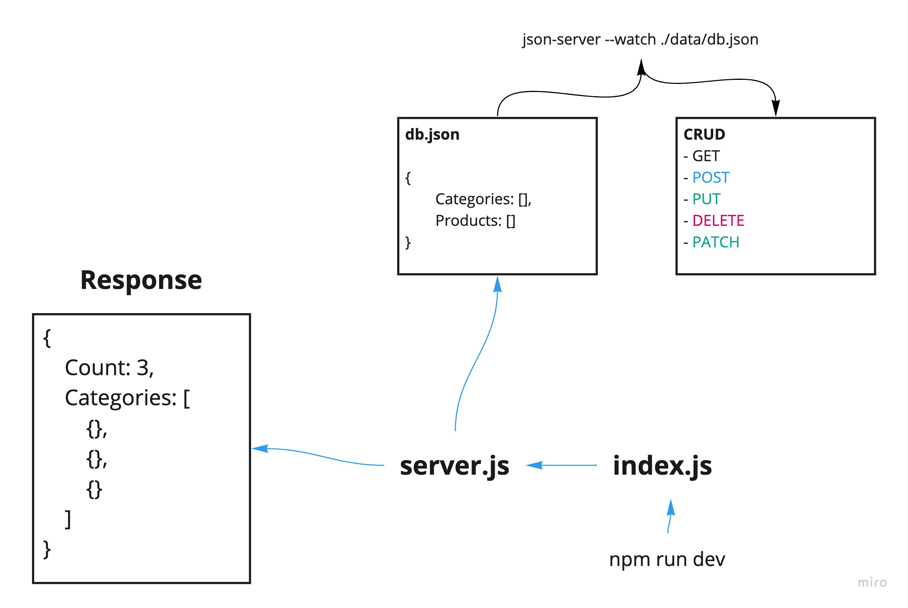

# api-server
API to serve data for a virtual storefront, which displays categories and products to a potential shopper
In Phase1, we’re going to build a simple API (with no code) to gain some clarity and visuals on proper route structure and the data contracts. We will use a product called ‘json-server’ to build a simple API server that fulfills all of our business requirements in a “sandbox”


 ## Links and Resources
- SwaggerHub : [Hub Link](https://app.swaggerhub.com/apis/wafifi/class06/0.1)
 - [submission PR/lab-06 ](https://github.com/waleedafifi-401-advanced-javascript/api-server/pull/1)
 

### Setup

- install json-server `npm i -g json-server`
- install express `npm i express`
- install nodemon `npm i nodemon --dev`

## How to initialize/run your application (where applicable)

* `json-server --watch ./data/db.json`
   * the code above for testing from json server dummy data
* `npm run dev` -> test stretch goals 
   * the code above test using express with custom response formate
   ```
   {
       Count: 3,
       Categories: [
           {},
           {},
           {}
       ]
   } 
   ```

### http request
```
http://loocalhost:3000/categories {GET, POST}
http://loocalhost:3000/categories/1 {GET, PUT, PATCH}
http://loocalhost:3000/products {GET, POST}
http://loocalhost:3000/products/1 {GET, PUT, PATCH}
```
 

## UML


