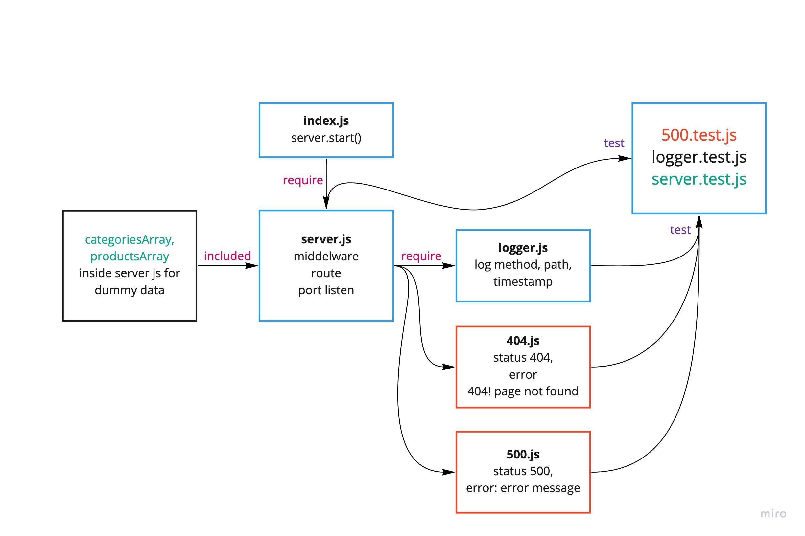

# api-server
In this lab, we’ll be using a moving away from `json-server` and creating a “real” API server of our own, using Express. Our express server will be coded for modularity and performance. You will replicate the input/output of `json-server` but storing data in memory to simulate full CRUD functionality, but without persistence.


 ## Links and Resources
- SwaggerHub : 
   - [Product hub Link](https://app.swaggerhub.com/apis/wafifi/products/0.1)
   - [Categories hub Link](https://app.swaggerhub.com/apis/wafifi/categories/0.1)
- [submission PR/lab-06 ](https://github.com/waleedafifi-401-advanced-javascript/api-server/pull/3)
 

### Setup

- install json-server `npm i -g json-server`
- install express `npm i express`
- install nodemon `npm i nodemon --dev`
- install jest `npm i jest --dev`
- install supertest `npm i supertest --dev`

* edit `package.json` where `script` -> `"test": "jest --coverage --verbose"`

## How to initialize/run your application (where applicable)

* `json-server --watch ./data/db.json`
   * the code above for testing from json server dummy data
* `npm run dev` -> test stretch goals 
   * the code above test using express with custom response format
   ```
   {
       Count: 3,
       Categories: [
           {},
           {},
           {}
       ]
   } 
   ```
* Logger will be like bottom
```
__REQUEST__ POST /products 9/14/2020 10:19:50 PM
__REQUEST__ GET /products 9/14/2020 10:20:02 PM
__REQUEST__ GET /products/2 9/14/2020 10:20:07 PM
__REQUEST__ PUT /products/2 9/14/2020 10:20:16 PM
__REQUEST__ PATCH /products/2 9/14/2020 10:20:28 PM
__REQUEST__ DELETE /products/2 9/14/2020 10:20:39 PM
```


### http request
```
http://loocalhost:3000/categories {GET, POST}
http://loocalhost:3000/categories/1 {GET, PUT, PATCH}
http://loocalhost:3000/products {GET, POST}
http://loocalhost:3000/products/1 {GET, PUT, PATCH}
```
 
### Testing
- `npm run test`
- Test files
   - `500.test.js`
   - `logger.test.js`
   - `server.test.js`

## UML


